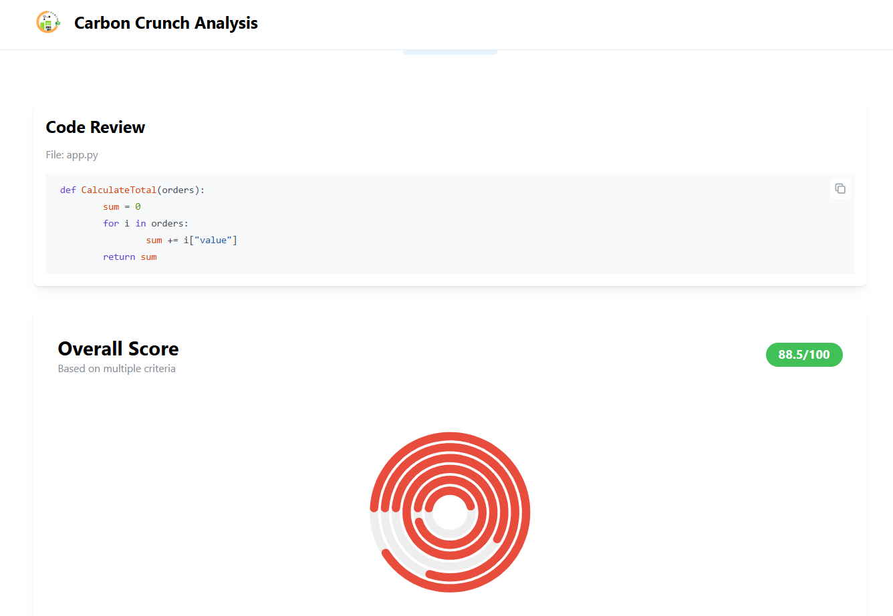
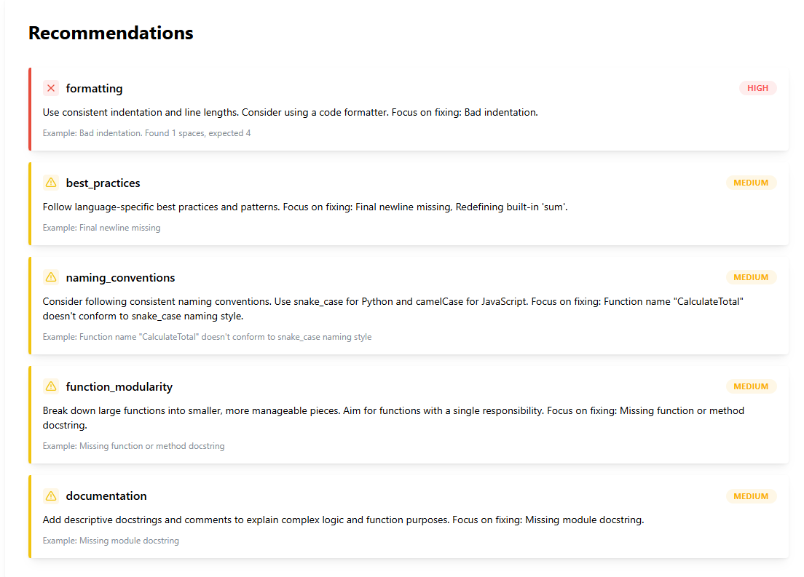
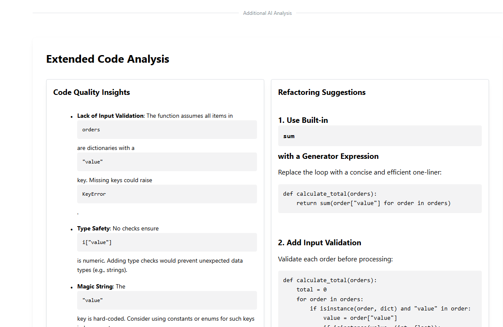
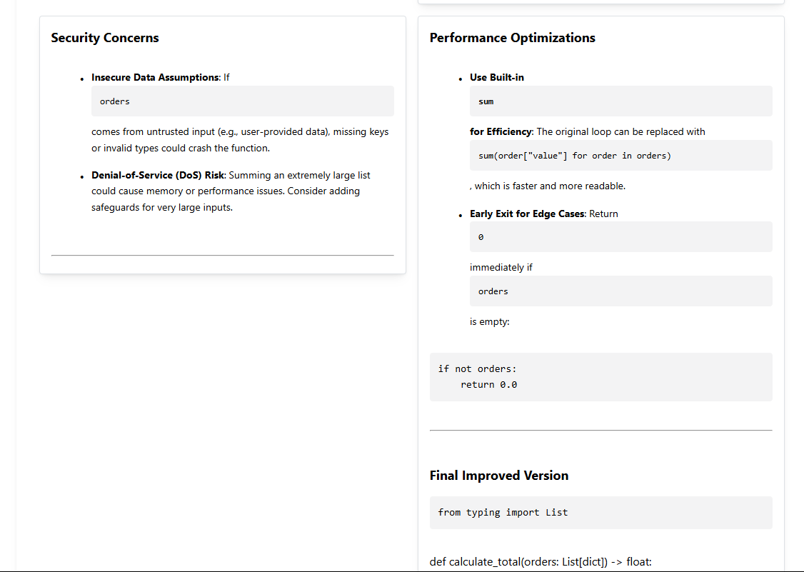
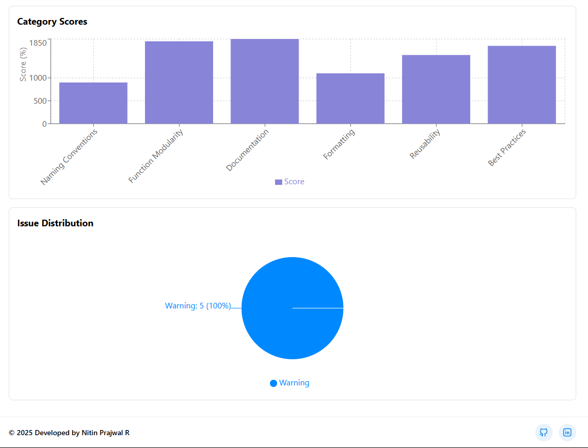

# Carbon Crunch - Code Analysis Tool

A modern web application for analyzing code quality and providing detailed insights for Python, JavaScript, and React files.

## Features

- 📊 Real-time code analysis
- 📈 Visual analytics with interactive graphs
- 🎨 Clean, modern UI
- 💻 Support for multiple programming languages
- 📝 Detailed code quality metrics
- 🔍 Issue detection and recommendations

## Tech Stack

### Frontend
- React with TypeScript
- Mantine UI Components
- Recharts for data visualization
- Syntax highlighting for code display

### Backend
- Python 3.12+
- FastAPI for API endpoints
- Advanced code analysis algorithms

## Getting Started

### Backend Setup

1. Make sure you have Python 3.12+ installed
2. Create a virtual environment:
```powershell
python -m venv venv
.\venv\Scripts\activate  # For Windows
source venv/bin/activate # For Unix/MacOS
```

3. Install dependencies:
```powershell
pip install -r requirements.txt
```

4. Start the backend server:
```powershell
uvicorn main:app --reload --host 0.0.0.0 --port 8000
```

The API will be available at `http://localhost:8000`

### Frontend Setup

1. Make sure you have Node.js and npm installed
2. Navigate to the frontend directory:
```powershell
cd frontend
```

3. Install dependencies:
```powershell
npm install
```

4. Start the development server:
```powershell
npm run dev
```

The application will be available at `http://localhost:5173`

## API Endpoints

- `GET /`: Health check endpoint
- `POST /analyze-code`: Upload and analyze code files
  - Accepts: `.py`, `.js`, `.jsx` files
  - Returns: Detailed analysis results including:
    - Code quality metrics
    - Issue detection
    - Recommendations
    - Severity breakdown

## Features in Detail

### Code Analysis
- Syntax error detection
- Code style checking
- Best practices validation
- Complexity analysis
- Function modularity assessment

### Visualization
- Interactive bar charts for code metrics
- Pie charts for issue distribution
- Real-time data updates
- Responsive design







### User Interface
- Drag and drop file upload
- Syntax highlighted code display
- Clean and intuitive layout
- Detailed analysis results

## Testing

### Backend Testing
Access the API documentation and testing interface at:
```
http://localhost:8000/docs
```

### Frontend Testing
Run the test suite with:
```powershell
cd frontend
npm test
```

## Development

### Running in Development Mode
1. Start the backend server (from project root):
```powershell
.\venv\Scripts\activate
uvicorn main:app --reload --host 0.0.0.0 --port 8000
```

2. Start the frontend development server (in another terminal):
```powershell
cd frontend
npm run dev
```

### Building for Production
1. Build the frontend:
```powershell
cd frontend
npm run build
```

2. The built files will be in the `frontend/dist` directory

## Contributing

1. Fork the repository
2. Create your feature branch
3. Commit your changes
4. Push to the branch
5. Create a new Pull Request

## License

This project is licensed under the MIT License - see the LICENSE file for details.

---

## Developer

Developed by Nitin Prajwal R © 2025

Connect with me:
- LinkedIn: [https://www.linkedin.com/in/nitinprajwal/](https://www.linkedin.com/in/nitinprajwal/)
- GitHub: [https://github.com/nitinprajwal](https://github.com/nitinprajwal) 